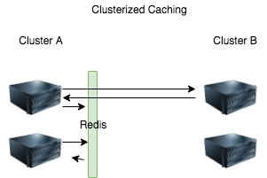

# Validation

# downloading redis mac/linux
https://redis.io/download
- cd to download dirctory
- `make`
- `./src/redis-server`
# Redis windows:
- For windows : https://github.com/dmajkic/redis/downloads

# Redis basics
- https://github.com/NodeRedis/node_redis
- In-memory key value store
- Has basic atomic operations + other cool features
- https://redis.io/commands
- Used for syncing variables across instances, caching and broadcasting updates

# Testing redis cli
- Start from same directory as redis server
- `./src/redis-cli`
- View commands here: https://redis.io/commands
- View all keys with `KEYS *`
- Try to view a key with `GET myKey`
- Try delete `DEL myKey`


# Lab todo:
- Add username/password field, and a button
- On click send the username/password combo to service 2 to validate 
- Store username and hashed password as cookie
- Add a new button that makes a request to service 1
- From service 1, validate the request by asking service 2
- Cache the response in service 1.
- Verify subsequent hits to service 1 do not hit service 2 for the timeout period



# BACKEND endpoints

### NOTE: all POST request returns a generic format
``` 
    {
        "ok": true,
        "response": {
            "object of interest" : "value"
        }
        
    }
```

#### NOTE: all FAILED requests is returned in the following format
``` 
    {
        "ok": false,
        "error": {
            "reason": "BLAH BLAH",
            "code":  number
        }
    }
```

- POST /api/auth/user/signup 
#####  sample valid data input
``` 
    {
        "user": {
            "username": "string",
            "password": "string",
            "email": "string"
        }
    }
```

- POST /api/auth/user/login
#####  sample valid data input
``` 
    {
        "user": {
            "email": "string",
            "password": "string"
        }
    }

    or

    {
        "user": {
            "username": "string",
            "password": "string"
        }
    }
``` 


### NOTE: Make sure to send the cookie received from authentication
###       when making request for the following endpoints.

- POST /api/auth/verify
##### NO input required, but requires valid cookie.
##### sample valid return
``` 
    {
        "ok": true,
        "response": {
            "sessionId": "string",
            "user": {
                "_id": "ObjectId",
                "email": "string",
                "username": "string"
            }
        }   
    }
```

- POST /api/auth/user/login
#####  NO input required, but requires valid cookie.

- POST /api/notes/new
#####  sample valid data input
``` 
    {
        "note": {
            "content": "string"
        }
    }
 ```

- POST /api/notes/edit
#####  sample valid data input
``` 
    {
        "note": {
            "_id": "ObjectId"
            "content": "string"
        }
    }
 ```

- GET /api/notes/all
##### sample valid return
``` 
    {
        "ok": true,
        "response": {
            "notes": [
                {
                    "_id": "ObjectId",
                    "content": "string"
                    "author": {
                        "username": "string",
                        "email": "string"
                    }
                },
                ...
                ..
                ...
                ..
            ]
        }
        "note": 
    }
 ```

- GET /api/notes/note/:id
##### sample valid return
``` 
    {
        "ok": true,
        "response": {
            "note": {
                "_id": "ObjectId",
                "content": "string",
                "author": {
                        "username": "string",
                        "email": "string"
                }
            }
        }   
    }
```
